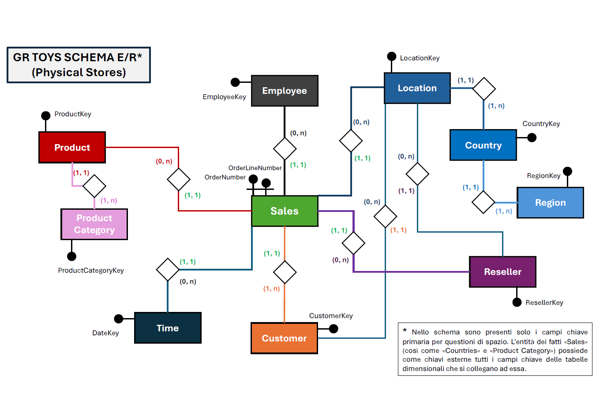
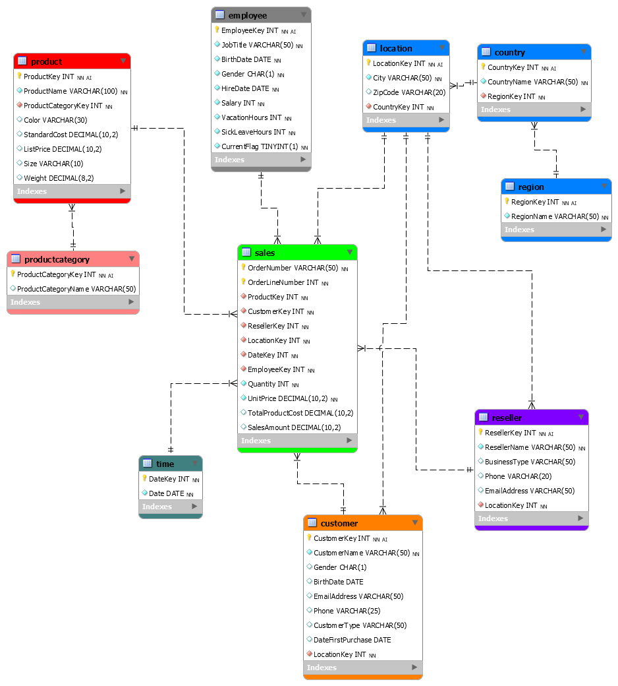
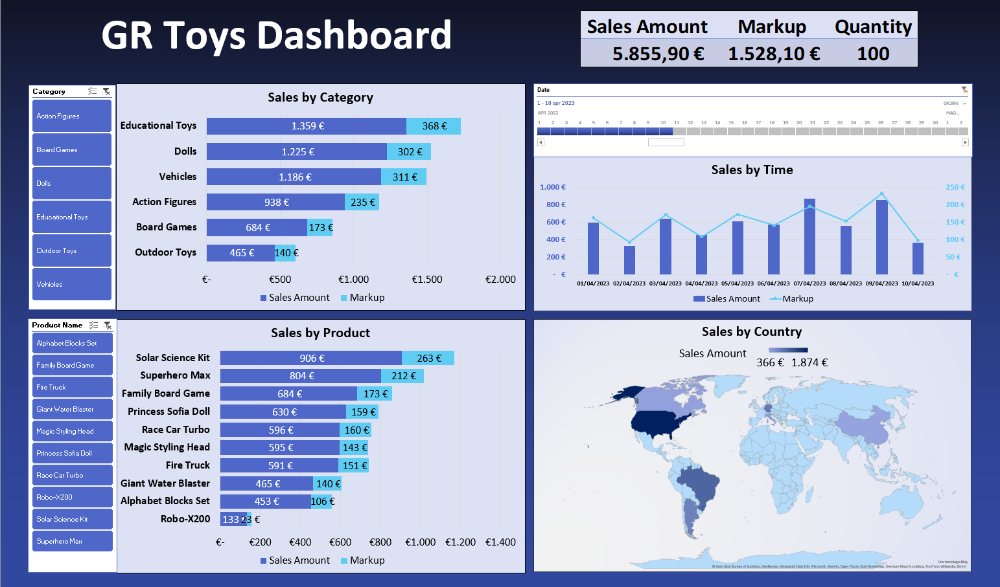

# GR Toys Data Warehouse & Excel Dashboard

## End-to-End SQL and Excel BI Project for Retail Sales Analytics

This project is an end-to-end **Data Warehouse and Business Intelligence project** developed for a fictional toy company.

The goal is to show the full analytical workflow behind a BI solution: from the initial business requirements and database design to SQL implementation, semantic views and final Excel dashboard.

The project follows this structure:

```text
Business Requirement
→ Conceptual Design
→ Logical Model
→ Physical Database Implementation
→ SQL Analytical Queries
→ Semantic Views
→ Excel Semantic Model
→ Dashboard
```

This makes the project more than a SQL exercise: it is a complete example of how raw business requirements can be translated into a structured analytical system.

---

## Project Navigation

- [Project Overview](#project-overview)
- [Business Question](#business-question)
- [Project Workflow](#project-workflow)
- [Visual Workflow](#visual-workflow)
- [Conceptual Design](#conceptual-design)
- [Logical Model](#logical-model)
- [Physical Implementation](#physical-implementation)
- [Analytical Queries](#analytical-queries)
- [Semantic Views](#semantic-views)
- [Excel Semantic Model and Dashboard](#excel-semantic-model-and-dashboard)
- [Repository Contents](#repository-contents)
- [How to Run and Use This Project](#how-to-run-and-use-this-project)
- [Skills Demonstrated](#skills-demonstrated)
- [Business Value](#business-value)
- [Limitations](#limitations)
- [Next Improvements](#next-improvements)
- [Disclaimer](#disclaimer)
- [Back to Portfolio](#back-to-portfolio)

---

## Project Overview

GR Toys simulates the analytical backend of a toy retail company that needs to monitor sales performance across products, customers, resellers, employees and geographic areas.

The project includes both the **database layer** and the **reporting layer**:

1. business requirement analysis;
2. conceptual data design;
3. logical model development;
4. physical database implementation in MySQL;
5. SQL analytical queries;
6. semantic SQL views;
7. Excel semantic model;
8. final Excel dashboard.

The project demonstrates how a Data Analyst / BI Analyst can move from data modeling to actionable reporting.

---

## Business Question

How can a toy company structure sales data into a relational data warehouse and use it to support business reporting?

More specifically, the project addresses questions such as:

- how should the business entities be represented in a relational model?
- how can sales transactions be connected to products, customers, employees, resellers and geography?
- are primary keys correctly defined and unique across tables?
- which products generate the highest sales volume?
- which products are sold above the average quantity in the latest available year?
- what is the yearly revenue by product?
- what is the revenue by country and year?
- which product category is most requested by the market?
- are there any unsold products?
- how can normalized SQL tables be transformed into semantic views for Excel reporting?
- how can those semantic views feed a final business dashboard?

---

## Project Workflow

The project follows a step-by-step BI development process.

| Step | Output | Purpose |
|---|---|---|
| **1. Conceptual Design** | Entity-level model | Identify the main business entities and relationships |
| **2. Logical Model** | Relational schema | Translate the conceptual model into tables, keys and relationships |
| **3. Physical Implementation** | SQL database | Create tables, constraints and sample data in MySQL |
| **4. Analytical Queries** | SQL analysis script | Validate data and answer business questions |
| **5. Semantic Views** | Reporting views | Create denormalized views for easier reporting |
| **6. Excel Semantic Model** | Excel workbook | Import SQL views and build relationships for analysis |
| **7. Dashboard** | Excel dashboard | Present sales insights in a business-friendly format |

---

## Visual Workflow

The project follows a complete design-to-dashboard workflow.  
The images below show the transition from conceptual design to logical modeling and final business reporting.

### 1. Conceptual Design

The conceptual model defines the main business entities and relationships before moving to table-level implementation.



---

### 2. Logical Model

The logical model translates the conceptual design into relational tables, keys and relationships.



---

### 3. Excel Dashboard

The Excel dashboard represents the final reporting layer built on top of the SQL data warehouse and semantic views.



---

## Conceptual Design

The conceptual design defines the main entities required to represent the retail sales scenario.

The conceptual model is shown in the [Visual Workflow](#visual-workflow) section and is also available as a standalone file:

[Open conceptual model](./ProgettazioneConcettuale.png)

The conceptual design helps clarify the business logic before moving to tables, keys and implementation.

It represents the high-level structure of the domain, including:

- sales;
- products;
- product categories;
- customers;
- resellers;
- employees;
- locations;
- countries;
- regions;
- time.

This step is important because it translates the business scenario into a clear analytical structure before the database is physically implemented.

---

## Logical Model

The logical model translates the conceptual design into a relational structure.

The model is shown in the [Visual Workflow](#visual-workflow) section and is also available in two formats:

- [View logical model PNG](./GR_Toys_ModelloLogico_Workbench_PNG.png)
- [Open MySQL Workbench model](./GR_Toys_ModelloLogico_Workbench.mwb)

The logical model follows a dimensional approach based on a central fact table and several dimensions.

### Fact Table

| Table | Description |
|---|---|
| `Sales` | Central transactional table containing order lines, product keys, customer keys, reseller keys, location keys, employee keys, quantities, unit prices, costs and sales amounts |

### Dimension Tables

| Table | Description |
|---|---|
| `Product` | Product-level information such as product name, color, standard cost, list price, size and weight |
| `ProductCategory` | Product category information |
| `Customer` | Customer-level information and customer type |
| `Reseller` | Reseller information and business type |
| `Employee` | Employee information related to sales activity |
| `Location` | City and zip-code level information |
| `Country` | Country-level information |
| `Region` | Macro-geographic region information |
| `Time` | Date dimension used for time-based analysis |

A supporting Excel file with table-level documentation is available here:

[Open logical table model](./Modello_Logico_Tabelle.xlsx)

---

## Physical Implementation

The physical implementation is provided in:

[Open physical implementation script](./GR_Toys_ImplementazioneFisica.sql)

The script creates the database:

```sql
CREATE DATABASE GR_Toys_Schema;
USE GR_Toys_Schema;
```

It then defines the core tables, primary keys and foreign key relationships.

The physical model includes:

- `Region`;
- `Country`;
- `Location`;
- `Employee`;
- `Reseller`;
- `Customer`;
- `Time`;
- `ProductCategory`;
- `Product`;
- `Sales`.

The `Sales` table is implemented as the central fact table and uses a composite primary key based on:

```sql
OrderNumber, OrderLineNumber
```

The script also populates the database with synthetic data designed for learning, analysis and portfolio demonstration.

---

## Analytical Queries

The analytical SQL logic is included in:

[Open analytical queries script](./GR_Toys_Queries.sql)

The script includes queries for:

| Analytical Area | Description |
|---|---|
| **Data Integrity Checks** | Verification of primary key uniqueness across implemented tables |
| **Transaction Exploration** | Extraction of transaction details including order number, date, product, category, country and region |
| **Product Performance** | Identification of products sold above the average quantity in the latest available year |
| **Yearly Revenue** | Calculation of total revenue by product and year |
| **Geographic Revenue** | Calculation of revenue by country and year |
| **Market Demand** | Identification of the most requested product category |
| **Unsold Products** | Detection of products with no sales using two different SQL approaches |
| **Semantic Views** | Creation of denormalized views for Excel and BI reporting |

This script combines technical checks and business-oriented analysis, making it suitable for a SQL/Data Analyst portfolio case study.

---

## Semantic Views

The project creates reporting-oriented SQL views to simplify downstream analysis.

These views act as a semantic layer between the normalized SQL database and the Excel dashboard.

### Product View

The query script creates the view:

```sql
GR_View_ToysProducts
```

This view denormalizes product and category information.

It includes:

- product key;
- product name;
- product category;
- color;
- size;
- weight;
- standard cost;
- list price.

### Geography View

The query script also creates the view:

```sql
GR_View_ToysGeography
```

This view denormalizes geographic information.

It includes:

- location key;
- city;
- zip code;
- country;
- region.

These views are designed to be imported into Excel and used as reporting-ready tables in the semantic model.

---

## Excel Semantic Model and Dashboard

The final reporting layer is implemented in Excel:

[Open Excel semantic model and dashboard](./GR_Toys_Semantic_Model_Views_Dashboard.xlsx)

The Excel workbook includes:

- imported SQL views;
- semantic model relationships;
- reporting-ready tables;
- dashboard visuals;
- business-oriented KPIs and summaries.

The dashboard represents the business-facing layer of the project.

It allows users to explore sales data through a more accessible interface, built on top of the SQL data warehouse and semantic views.

A preview of the dashboard is shown in the [Visual Workflow](#visual-workflow) section.

---

## Repository Contents

| File | Description | How to Use |
|---|---|---|
| [`README.md`](./README.md) | Main project documentation | Start here to understand the full workflow |
| [`ProgettazioneConcettuale.png`](./ProgettazioneConcettuale.png) | Conceptual model preview | Open to inspect the high-level design |
| [`GR_Toys_ModelloLogico_Workbench_PNG.png`](./GR_Toys_ModelloLogico_Workbench_PNG.png) | Logical model image | Use it to review tables and relationships |
| [`GR_Toys_ModelloLogico_Workbench.mwb`](./GR_Toys_ModelloLogico_Workbench.mwb) | MySQL Workbench logical model | Open with MySQL Workbench |
| [`Modello_Logico_Tabelle.xlsx`](./Modello_Logico_Tabelle.xlsx) | Logical table documentation | Open to review table-level modeling details |
| [`GR_Toys_ImplementazioneFisica.sql`](./GR_Toys_ImplementazioneFisica.sql) | SQL script for database creation, table definition and data population | Run this script first in MySQL |
| [`GR_Toys_Queries.sql`](./GR_Toys_Queries.sql) | SQL script containing integrity checks, analytical queries and reporting views | Run after the physical implementation |
| [`GR_Toys_Semantic_Model_Views_Dashboard.xlsx`](./GR_Toys_Semantic_Model_Views_Dashboard.xlsx) | Excel workbook with semantic model, SQL views and dashboard | Open this file to explore the final reporting layer |
| [`GR_Toys_Dashboard.png`](./GR_Toys_Dashboard.png) | Dashboard preview image | Use it as a quick visual preview in GitHub |

---

## How to Run and Use This Project

### 1. Review the design phase

Start by opening the conceptual and logical models:

- [Conceptual model PNG](./ProgettazioneConcettuale.png)
- [Logical model PNG](./GR_Toys_ModelloLogico_Workbench_PNG.png)
- [MySQL Workbench model](./GR_Toys_ModelloLogico_Workbench.mwb)

This step helps understand how the business scenario was translated into an analytical data model.

---

### 2. Run the physical implementation script

Open **MySQL Workbench** or another MySQL-compatible SQL client.

Then execute:

[GR_Toys_ImplementazioneFisica.sql](./GR_Toys_ImplementazioneFisica.sql)

```sql
SOURCE ./GR_Toys_ImplementazioneFisica.sql;
```

This script creates the database schema, tables, constraints and sample data.

---

### 3. Run the analytical queries and semantic views

After creating and populating the database, execute:

[GR_Toys_Queries.sql](./GR_Toys_Queries.sql)

```sql
SOURCE ./GR_Toys_Queries.sql;
```

This script includes:

- primary key uniqueness checks;
- transaction-level analytical queries;
- product performance queries;
- geographic revenue analysis;
- unsold product checks;
- semantic view creation.

---

### 4. Test the semantic views

You can test the reporting views with:

```sql
SELECT *
FROM GR_View_ToysProducts;

SELECT *
FROM GR_View_ToysGeography;
```

These views can be used as simplified reporting tables for Excel or Power BI.

---

### 5. Open the Excel dashboard

Open the Excel workbook:

[GR_Toys_Semantic_Model_Views_Dashboard.xlsx](./GR_Toys_Semantic_Model_Views_Dashboard.xlsx)

Use it to explore:

- the semantic model;
- imported SQL views;
- dashboard visuals;
- sales reporting outputs;
- business-oriented summaries.

This file represents the final reporting layer of the project.

---

## Skills Demonstrated

This project demonstrates the following skills:

- business requirement translation into a data model;
- conceptual data modeling;
- logical schema design;
- MySQL Workbench modeling;
- physical database implementation;
- SQL DDL;
- SQL DML;
- primary key and foreign key constraints;
- star schema design;
- data integrity checks;
- joins across multiple tables;
- aggregation queries;
- subqueries;
- analytical SQL;
- SQL view creation;
- semantic layer preparation;
- Excel data modeling;
- Excel dashboard design;
- BI reporting workflow.

---

## Business Value

This project shows how a retail company can structure transactional sales data for analytical and reporting purposes.

Potential business use cases include:

- monitoring product sales performance;
- identifying top-selling products and categories;
- analyzing revenue by geography;
- detecting unsold products;
- preparing clean reporting views for BI dashboards;
- connecting SQL outputs to Excel reporting;
- supporting sales analysis through an accessible dashboard;
- improving data quality through integrity checks;
- creating a reusable semantic layer for business users.

---

## Limitations

This project should be interpreted as an educational and professional portfolio project.

Main limitations include:

- the dataset is synthetic and designed for learning purposes;
- the business scenario is simplified compared to a production retail environment;
- the dashboard is implemented in Excel and based on the current semantic views;
- the current project does not include an automated refresh pipeline;
- additional documentation could further clarify the data generation logic;
- a Power BI version could be developed as a future extension.

---

## Next Improvements

Future improvements may include:

- adding a short executive summary with key business insights;
- adding a data dictionary for all tables and fields;
- documenting the data generation logic;
- adding screenshots of SQL query outputs;
- creating a Power BI version of the dashboard;
- improving folder organization with dedicated `docs/` and `assets/` folders.

---

## Disclaimer

This project is intended for educational and professional portfolio purposes only.

The dataset is synthetic and was created to demonstrate SQL, data modeling, semantic views and business intelligence concepts.

---

## Back to Portfolio

[Return to the main portfolio](../README.md)
